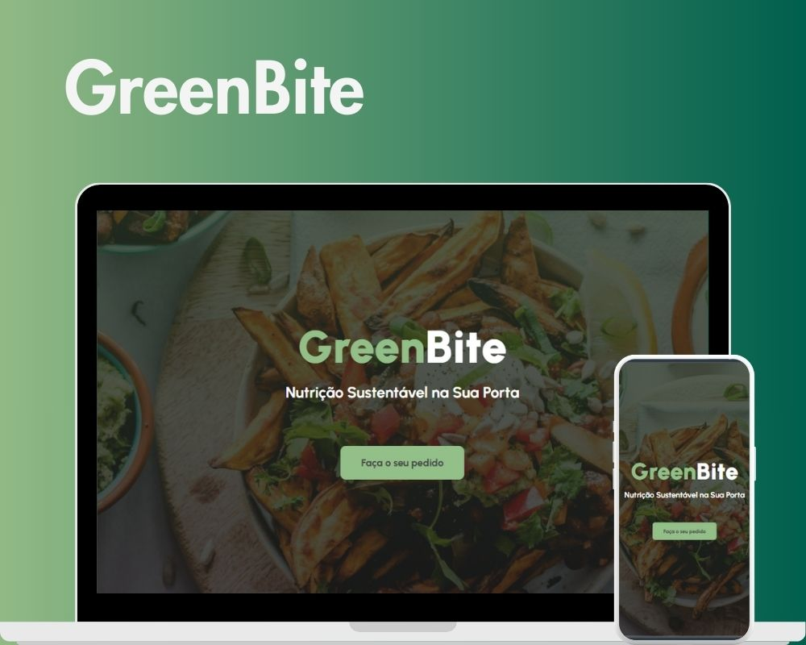

<h1 align="center"> Landing Page - GreenBite </h1>

  <a href="#-tecnologias">Tecnologias</a>&nbsp;&nbsp;&nbsp;|&nbsp;&nbsp;&nbsp;
  <a href="#-projeto">Projeto</a>&nbsp;&nbsp;&nbsp;|&nbsp;&nbsp;&nbsp;
  <a href="#-licença">Licença</a>

  

 

  

## 🚀 Tecnologias

Esse projeto foi desenvolvido com as seguintes tecnologias:

- HTML e CSS
- Git e Github

## 💻 Projeto

Landing page para uma empresa fictícia de delivery de alimentos. A página possui 4 seções: Home, sobre nós, menu do dia e contato. 

## 📝 Licença

Esse projeto está sob a licença MIT.

---

Feito por Sullara Tavares
